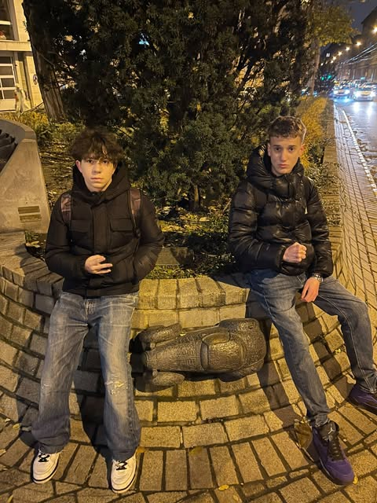

  # A tizennégy karátos autó
> 

 ## A tizennégy karátos autó története
>   *A Budapestet korábban már számos miniszoborral bővítő ungvári szobrászművész, Mihajlo Kolodko (Kolodko Mihály, 1978-) új köztéri alkotása Rejtő Jenő 1940-ben megjelent műve, A tizennégy karátos autó címadó járművét örökíti meg, a Kodolkóra jellemzőnél sokkal nagyobb méretben.*

A szerző légiósregényeinek sorában kiemelkedő helyet betöltő mű főszereplője Gorcsev Iván, aki miután makaón elnyerte a fizikai Nobel-díjat, és dúsgazdaggá vált, beleszeret egy gazdag francia férfi, Gustave Laboux lányába, sőt, el akarja venni feleségül. Az apának egyetlen kikötése van ez ellen: Gorcsevnek előbb be kell lépnie a francia idegenlégióba. Ez természetesen meg is történik, de a főhős nyakig belekeveredik az apa gondjaiba, és megpróbál segíteni neki, visszaszerezve az ellopott Alfa Romeóját, ami kétharmad részben tizennégy karátos aranyból készült.

  >*"A nikkellel befuttatott fényszórók, a sebességváltó, a lökhárító, az alváz abroncsa, a hamutartók és kilincsek színaranyból készültek. A legkitűnőbb motort építették be, de nagy súlya miatt még így is gyengének bizonyult a fék, és csak lecsökkent sebességre volt képes."– írja a regényben Rejtő, akinek szavait Kolodko nem szó szerint vette, hiszen az alkotásán az autó ablaküvegei, illetve az első és hátsó lámpák kaptak arany színt, de ez a lényegen természetesen semmit sem változtat.*

A mindössze egyetlen lépésre álló Folyamat című alkotás (1985) ellentétes oldalán, az író nevét 2001. októbere óta viselő utca nyitányánál egyébként egy jókora kőtömb is helyet kapott, így mától elmondhatjuk, hogy Rejtő Jenő az első magyar alkotó, akinek alig néhány méteres körön belül két – sőt, a kis teresedésre néző, 6. számot viselő szülőházának falán lévő emléktáblával együtt három – emléket is állítottak.

## Elhelyezkedése:

    A Rejtő Jenő regényből inspirált tizennégy karátos autót a Magyar Színház bejáratával szemben lehet megtekinteni a 7.kerületben

### Források:
----

   >24.hu
 https://24.hu/kultura/2019/08/28/rejto-jeno-klasszikusanak-es-noe-barkajanak-miniszobra-budapest-kolodko-mihaly/

