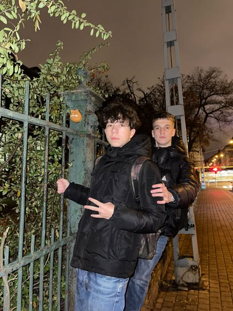

  # Garfield szobor budapesten:
> 

   ##  Ki az a Garfield?
> **Garfield egy 1978-ban elindult**   képregény sorozat volt egy lusta és falánk  macskáról aminek hatalmas  sikere után  **több filmes és sorozat adaptációt kapott**.
## Szobor története
A Garfield  **45.születésnapját**   töltötte amikor Kolodkó meglepte a várost újabb művével. Kolodkó valószínűleg azért is csinálta mert ugyan annyi éves a sorozat mint a művész.

## Szobor elhelyezkedése
 A szobor az   **Állattudományi Egyetem** oldalán egy kerítésen található a 7.dik kerületben.

### Források:

  > 1.Telex.hu 
 https://telex.hu/kult/2023/06/19/kolodko-mihaly-szobor-garfield

   >2. 24.hu
https://24.hu/kultura/2023/06/19/garfield-macska-kolodko-miniszobor-45-eves/

