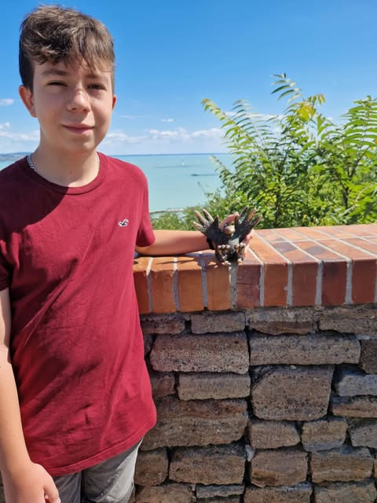

  # Kolodkó:Gombóc Artúr
> 

##  Ki az a    Gombóc   Artúr?

 > **Gombóc Artúr  egy kitalált figura, rajzfilmszereplő. Kék színű kövér madár**a Csukás István ötlete alapján készült Pom Pom meséi című rajzfilmsorozatban, rajzolt figuráját Sajdik Ferenc grafikusművész alkotta meg. A sorozatban főszereplő, a legtöbb epizódban megjelent.

## Hol található meg?

A  **tihanyi apátsági templomhoz**   vezető Pisky sétányon található Kolodko Mihály miniszobra,
    *Gombóc Artúr*   miniatűr bronzba öntött mása.

## Források:

* Csodás balaton.hu
https://csodalatosbalaton.hu/latnivalok/muemlekek-szobrok/gomboc-artur-szobor-tihany/

*  Wikipedia
https://hu.wikipedia.org/wiki/Gomb%C3%B3c_Art%C3%BAr#:~:text=Gomb%C3%B3c%20Art%C3%BAr%20egy%20kital%C3%A1lt%20figura,f%C5%91szerepl%C5%91%2C%20a%20legt%C3%B6bb%20epiz%C3%B3dban%20megjelent.

