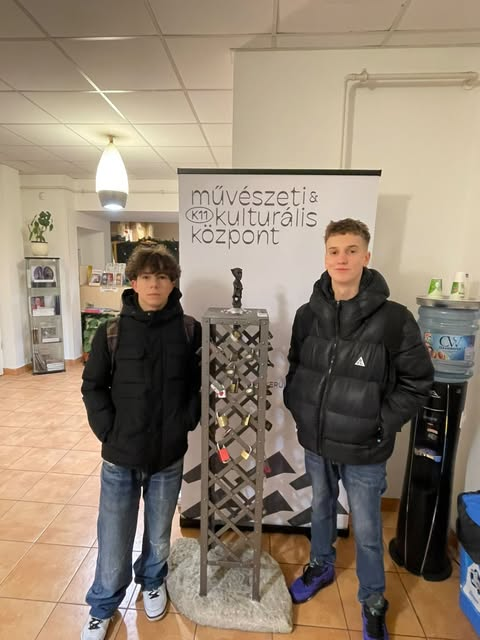

 #  Harry Houdini
> 

  ##   Hol található meg a szobor?
    
  **K11 Művészet és kultúra központban tekinthető meg teljesen ingyen.** Ez a gozsdu udvarban található a Deák Ferenctértől nem messze.

  ## Ki volt Houdini?
  Harry Houdini, születési nevén Weisz Erik, világhírű magyar származású amerikai illuzionista és szabadulóművész volt. 1874. március 24-én született Budapesten, majd családjával 1878-ban az Egyesült Államokba emigrált. Houdini a modern szabadulóművészet úttörője és legendás alakja lett.

Houdini először mutatványosként lépett fel, de világhírnévre a látványos szabadulóműsorai révén tett szert. Olyan trükköket hajtott végre, amelyek során bilincsekből, láncokból, lezárt ládákból vagy vízzel teli tartályokból szabadult ki. Egyik leghíresebb mutatványa a „vízalatti kínzókamra” volt, amelyben fejjel lefelé víz alá merülve szabadult ki.

Houdini nemcsak szórakoztató előadóként vált ismertté, hanem a spiritizmus ellenzőjeként is. Szenvedélyesen leplezte le a korabeli spiritisztákat és médiumokat, akikről úgy vélte, hogy csalással élnek.
	1926.	október 31-én, Halloween napján halt meg, feltehetően egy fertőzés következtében, amelyet egy váratlan gyomorra mért ütés okozhatott. Halála óta neve az illúzió, a bátorság és a misztikum szinonimájává vált.

