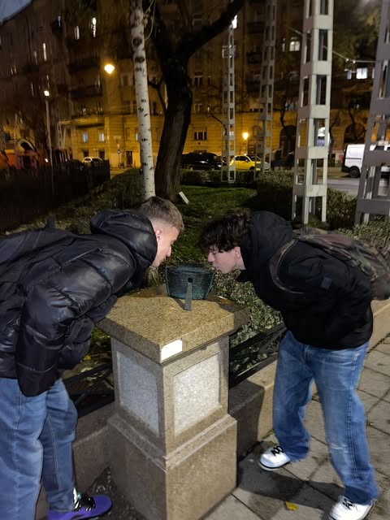

  # _Noé bárkája  aprócska  szobor_
  > 

## Szobor elhelyezkedése 
 Az **Állatorvosi  Egyetemmel** szembe lévő *Bethlen Gábor*  téren helyezkedik el a 7.  Budapesti kerületben. Kolodkó nagyon szerethette a 7. kerületet mert itt 4db   alkotása is van.

## A szobor
> A szobrot a  **Biblia azon belül Mózes könyvéből ismert Noé bárkája-történetet**  eleveníti fel.  Kolodkó nem csak gyerekműsörokból,filmekből,történelmi eseményekből merít hanem **Szent Írásból**   is ami figyelemre méltó.    Fontos ,hogy ismertesse az irodalom egyik legalabbvetőbb művet  a  **Bibliát**. A szobrot egy napon állította ki a tizennégy karátos autóval.

### Források:
   *    24.hu   

https://24.hu/kultura/2019/08/28/rejto-jeno-klasszikusanak-es-noe-barkajanak-miniszobra-budapest-kolodko-mihaly/#google_vignette

