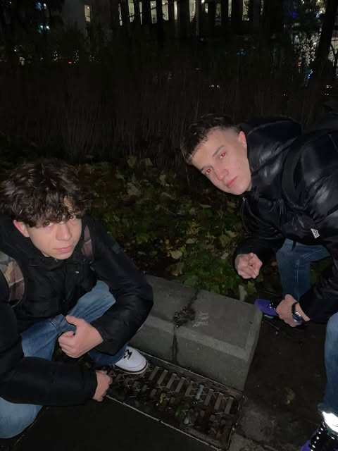

# Kolodkó Mihály: _Sztálin csizmája_ (AMONG US)
>

## A Szobor története
A _szobor_ az **Ötvenhatosok terére került**, egykor ugyanis itt állt az a _Sztálin-szobor_, melyből az **1956-os forradalom során történt** ledöntése után csak a két csizma maradt ott. Emiatt az egykori *Sztálin teret* pár napig *„Csizma térnek”* is hívták. A gördeszka pedig valószínűleg arra utal, hogy a **nemrégiben átadott múzeum egy óriási gördeszkapályára hasonlít**.

 ## A Szobor elhelyezkedése
> **Sztálin csizmája** nevű miniatúr szobor is a _városligetben_ található az **Olvasó Drakulával** együtt. Azonban ez a _Néprajzi Múzeum_ mellet található egy patkán ,a 30-as buszmegalló közelében.

 ## Személyes velemény
Én fontosnak tartom ezeket a*művészeti darabokat*n alapból nagyon szeretem a művészetnek minden formáját és fontosnak tartom hogy egy fővárosban minnél több lehetőség legyen a művészetnek kiteljesedni amíg az senkinek a kárára nem megy.

### Források:
 We love budapest
https://welovebudapest.com/cikk/2022/10/23/latnivalok-es-kultura-uj-kolodko-szobor-neprajzi-muzeum-mellett-sztalin-csizma-1956

