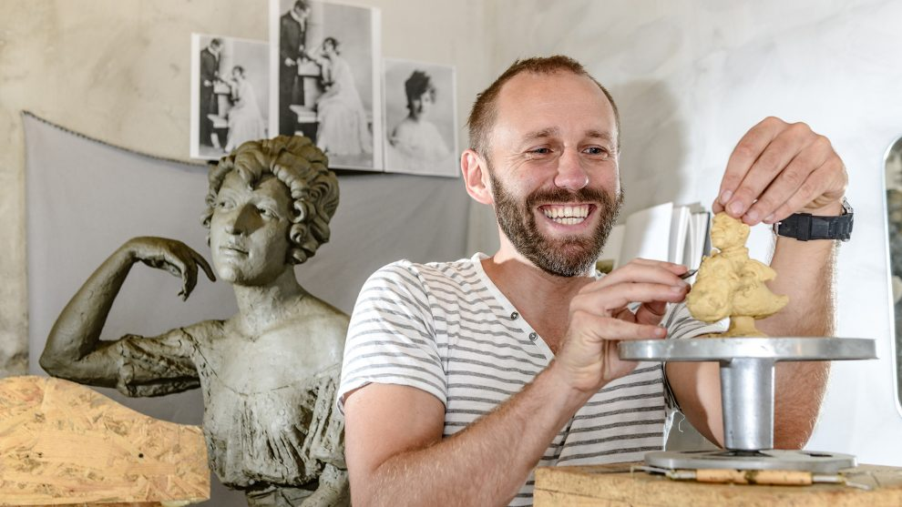

# Kolodkó Mihály élete és munkássága

>Képek Kolodkó Mihályról:
 
  
  

**Kolodkó Mihály _származása_**:
-

**1978-ban született** a kárpátaljai _Ungváron_. Anyai ágon *magyar* származású. *Szovjet* és *Ukrán* állampolgár. **2017-ben magyarországra költözött**.

**Kolodkó tanulmányai,munkásságai**:
-
_1996-ban_ végezte el az **_Ungávári Művészeti iskolát_**, majd *2002-ben* szerzett diplomát a **_Lembergi Művészeti Akadémia_** szobrász szakán.

Tanulmányai során csoportos, illetve **plein air** projektekben dolgozott _Ukrajnában_ és _külföldön_ is. A **plein air** lényege a természetes fény, a természetes megvilágítás, a szabad téri munka.

A műfaji- és a monumentális szobrászat mellett kezdett el miniatűr figurákat megjeleníteni köztereken, először szülővárosában, *Ungváron*. A kárpátaljai városban látható többek közt **Liszt Ferenc**, **Csontváry-Kosztka Tivadar**, **Andy Warhol**, és **Nagy Péter cár** szobrocskája, egy miniatűr _Eiffel-torony_ és egy dundi _Szabadság-szobor_ is.

## Miniszobrok története

>Azok, akik a Bem rakparton szoktak sétálni, egyszer csak felfedeztek a mellvéden egy ismerős, bronzból készült kis figurát. A nagy ho-ho-horgász című rajzfilmből ismert Főkukac volt az. Eleinte senki sem tudta, hogyan került oda, és azt sem, kinek köszönhetjük

Később, ugyancsak a kő mellvéden, megjelent egy apró tank szobrocska, amelyik az orrát, pontosabban a csövét lógatta, *„Ruszkik, haza”* felirattal az oldalán. Azután a *Szabadság-téren* bukkant fel **Breki, a Muppet Show főszereplője, lelke, műsorvezetője**.

 **Ekkor kezdtek el először megjelenni a cikkek** Kolodko Mihályról és arról, hogy *Ungvárt* követően *Budapesten* is elkezdett gerillamódszerrel, váratlanul szobrokat kihelyezni.

>A Főkukac története a szobrász gyerekkorába vezet vissza: az egyik kedvence ugyanis az 1980-as években hihetetlenül népszerű A nagy ho-ho-horgász című rajzfilm volt. A mesét Csukás István írta, a figurákat Sajdik Ferenc rajzolta. Amikor Kolodko Mihály Magyarországra költözött a családjával, szerette volna, ha a gyerekeit emlékezteti valami Ungvárra, életük addigi helyszínére, ezért készítette el még egy példányban a Főkukacot, a helyét pedig a gyermekeivel együtt választotta ki.

**2018-ban _Liszt Ferenc_ kapott miniatűr szobrot** – hol máshol, mint *Ferihegyen*, vagyis a *Liszt Ferenc Nemzetközi Repülőtéren* –, a **_Széll Kálmán téren_** megjelent **_Mekk Elek_** (szokás szerint kontár munkával, hiszen elszúrta az kezében látható utcanévtáblán a feliratot), majd egy földön fekvő, körberajzolt, pisztolyt szorongató kis mókus a Nagykörútnál, Columbo, a tévés nyomozó szobra mögött.

### Források
* Blog.hu
https://cimlap.blog.hu/posztok/mrfoster/2022/10/26/itt_az_osszes_budapesti_kolodko_miniszobor_egy_helyen
* Wikipedia
https://commons.wikimedia.org/wiki/Category:Mihajlo_Kolodko

