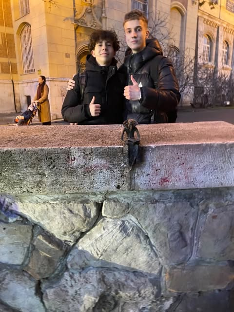

# _Olvasó Drakula_ 
> 
_____
 ## A Szobor elhelyezkedése
  Az **_Olvasó Drakula_** a _Vajdahunyadvár_ másolata mögött található ami pedig a *Városligetben található*.
  ## Szobor külseje 
> A szobor A _Hartmuth Zech_ által épp húsz éve kihelyezett, _Lugosi Béla_ féle _Drakulát_ ábrazolja miniszobor formában olvasó pozícióban. A szobor Kolodkó Mihály keze munkája. A szobrok amiket Kolodkó csinál azért miniatűrek, hogy
csökkentse a előállítási költségeket és így is több karaktert ad a munkásságának. Mivel nem nagy szobrokat csinál mint a *Szabadság Szobor* a *Gellért-hegyen* így sokkal többet eltud rejteni a városban.

## Szobor jelentőssége

A _szobor_ **fontos értékkel bír.**  A _szobor_ egy **műalkotás színesíti városunkat,miközben művel** .Mire gondolok az alatt ,hogy művel? Arra hogy például sétál egy család városunkban és egyszer meglátja ezt a művet. Meglátja,megcsodálja és kiváncsi lesz hogy mit és honnan ábrázolja a szobrot az alkotó és mivel kiváncsi rákeres és megnézi az adott sorozatot,filmet esetleg rákeres az alkotóra és ezáltal művelődik.

## Források
* 24.hu https://24.hu/kultura/2023/05/22/kolodko-aprocska-drakula-szobra-tunt-fel-a-vajdahunyadvarnal/

